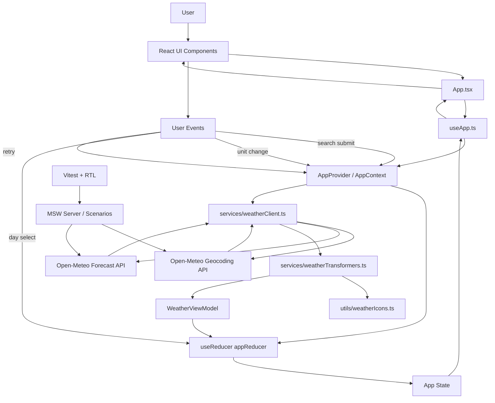
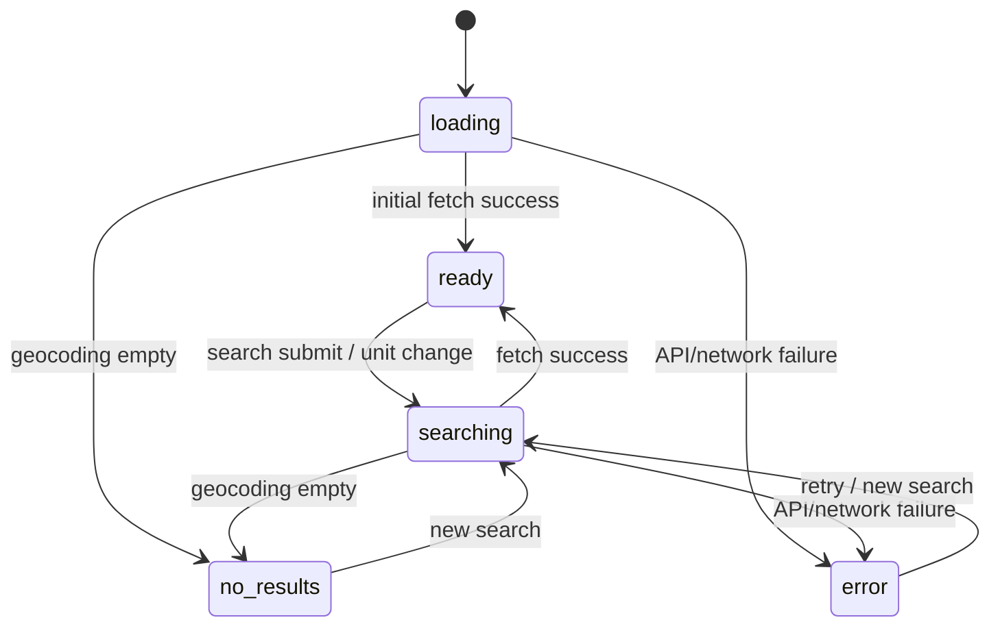
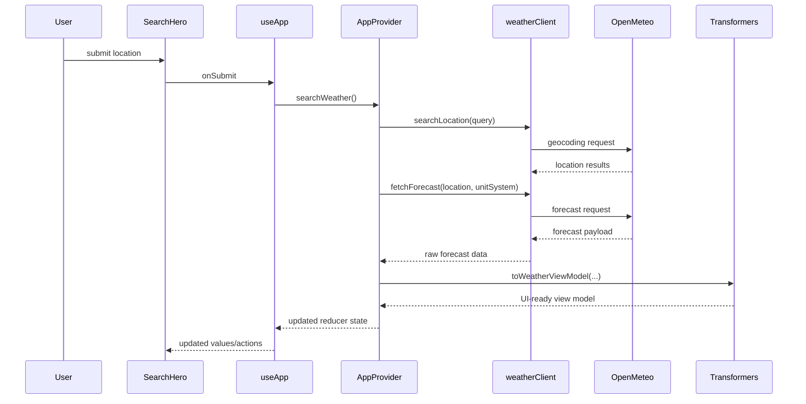

# Weather Now

A React + TypeScript weather dashboard built for the Frontend Mentor Weather App challenge. The app searches locations through Open-Meteo geocoding, fetches forecast data from Open-Meteo weather endpoints, transforms that data into UI-ready view models, and renders different design-driven states for loading, search-in-progress, no-results, and API errors.

## Contents

- [Overview](#overview)
- [Architecture](#architecture)
- [State Flow](#state-flow)
- [Data Flow](#data-flow)
- [Project Structure](#project-structure)
- [Testing Strategy](#testing-strategy)
- [Test Inventory](#test-inventory)
- [Test Doubles](#test-doubles)
- [Run Locally](#run-locally)
- [API References](#api-references)

## Overview

Users can:

- Search for a location
- View current weather details
- See metric cards for feels like, humidity, wind, and precipitation
- Browse a 7-day daily forecast
- View hourly temperatures for the selected day
- Toggle metric and imperial units
- See design-driven loading, no-results, and error states

## Architecture

### High-Level Flow



### Layer Responsibilities

- `App.tsx`
  Orchestrates screen-level rendering and switches between loading, ready, no-results, and error UI states.

- `useApp.ts`
  Acts as the app-facing selector/hook layer. It reads from context state and exposes values/actions in a component-friendly shape.

- `context/AppProvider.tsx`
  Owns the reducer, async workflows, request sequencing, retry behavior, and unit refresh logic.

- `services/weatherClient.ts`
  Contains the raw network boundary for geocoding and forecast requests.

- `services/weatherTransformers.ts`
  Converts raw Open-Meteo payloads into UI-ready structures such as current card data, metrics, daily forecast cards, and hourly entries.

- `utils/weatherIcons.ts`
  Maps Open-Meteo weather codes to local design assets and condition labels.

- `components/*`
  Presentation components for header, search hero, current weather, metrics, daily forecast, and hourly forecast.

## State Flow



### Reducer State Meaning

- `loading`
  Initial app boot or full fetch without prior data. The dashboard renders skeleton-like placeholders based on the design.

- `ready`
  Weather data is fully available and the dashboard renders the live forecast.

- `searching`
  A search or unit change is in progress while existing weather data is preserved on screen, with a progress notice shown above the dashboard.

- `no-results`
  Geocoding returned zero matches, so the app renders the dedicated no-results state.

- `error`
  Network or API failure occurred, so the app renders the dedicated error state with retry.

## Data Flow



### Why This Split Exists

- The network boundary is isolated.
- Transformations stay pure and testable.
- The reducer owns state transitions instead of scattering state across components.
- UI components mostly render props, which keeps them easy to unit test.

## Project Structure

```text
src/
  components/
    forecast/
    layout/
    search/
    weather/
  context/
    AppProvider.tsx
  data/
    weather.ts
  services/
    weatherClient.ts
    weatherTransformers.ts
  test/
    msw/
    test-doubles/
    setupTests.ts
  utils/
    weatherIcons.ts
  App.tsx
  useApp.ts
```

## Testing Strategy

The test strategy is layered:

- Unit tests for presentational components
  Verify rendering, empty states, selected states, and callback wiring using props and spies.

- Unit tests for app-facing hooks
  Verify hook-level behavior and derived outputs through controlled context setup.

- Integration tests for app/API flow
  Render the full app and use MSW to simulate Open-Meteo behavior end to end.

- MSW scenario verification tests
  Validate that each mocked API scenario returns the expected payload, delay, or failure shape before relying on it in integration tests.

## Test Inventory

### Unit Tests

- [`src/components/layout/AppHeader.test.tsx`](/Users/malsaslam97/Desktop/aslam@work/weather-app/src/components/layout/AppHeader.test.tsx)
  Unit test. Verifies units menu interactions and selected-unit rendering.

- [`src/components/search/SearchHero.test.tsx`](/Users/malsaslam97/Desktop/aslam@work/weather-app/src/components/search/SearchHero.test.tsx)
  Unit test. Verifies search input changes, whitespace submission, and long-query handling.

- [`src/components/weather/WeatherMetrics.test.tsx`](/Users/malsaslam97/Desktop/aslam@work/weather-app/src/components/weather/WeatherMetrics.test.tsx)
  Unit test. Verifies metric card ordering and empty metrics state.

- [`src/components/forecast/DailyForecast.test.tsx`](/Users/malsaslam97/Desktop/aslam@work/weather-app/src/components/forecast/DailyForecast.test.tsx)
  Unit test. Verifies day selection, selected styling, and empty forecast state.

- [`src/components/forecast/HourlyForecastPanel.test.tsx`](/Users/malsaslam97/Desktop/aslam@work/weather-app/src/components/forecast/HourlyForecastPanel.test.tsx)
  Unit test. Verifies hourly rendering, empty hourly state, and fallback temperature display.

- [`src/useApp.test.ts`](/Users/malsaslam97/Desktop/aslam@work/weather-app/src/useApp.test.ts)
  Unit-oriented hook test. Verifies app-facing hook behavior through the provider boundary.

### Integration Tests

- [`src/App.api.test.tsx`](/Users/malsaslam97/Desktop/aslam@work/weather-app/src/App.api.test.tsx)
  Integration test. Renders the app with `AppProvider`, drives user interactions, and verifies API-backed success, no-results, and error flows through MSW.

- [`src/test/msw/scenarios.test.ts`](/Users/malsaslam97/Desktop/aslam@work/weather-app/src/test/msw/scenarios.test.ts)
  Integration-style test for the mock layer itself. Verifies MSW handlers for success, delay, network failures, malformed payloads, empty data, multiple matches, and sequential responses.

## Test Doubles

Test doubles are controlled replacements for real collaborators in tests.

### Stub

A stub returns predefined data so a test can force a code path.

In this project:

- MSW scenario payloads act as stubs for Open-Meteo responses.
- Factory helpers like `makeForecastDay` and `makeHourlyEntry` provide stub data for presentational component tests.

### Spy

A spy records how a function was called.

In this project:

- `vi.fn()` is used to verify callbacks like `onSelectDay`, `onToggleUnits`, `onSelectUnit`, `onQueryChange`, and `onSubmit`.

### Fake

A fake is a lightweight working implementation that behaves like the real dependency in a simplified way.

In this project:

- MSW is the main fake network layer. It behaves like the real API boundary from the app’s point of view, but stays deterministic and local to tests.

### Mock

A mock is a pre-programmed double with expected interactions baked into the test.

In this codebase, we mostly avoid heavy mock-style testing and prefer stubs, spies, and MSW-driven fake integration because they are easier to maintain and less coupled to implementation details.

### Current Test Double Files

- [`src/test/test-doubles/weather.ts`](/Users/malsaslam97/Desktop/aslam@work/weather-app/src/test/test-doubles/weather.ts)
  Factory-based test data for component unit tests.

- [`src/test/msw/factories.ts`](/Users/malsaslam97/Desktop/aslam@work/weather-app/src/test/msw/factories.ts)
  Factory helpers for API response payloads.

- [`src/test/msw/scenarios.ts`](/Users/malsaslam97/Desktop/aslam@work/weather-app/src/test/msw/scenarios.ts)
  Named MSW scenarios for success, no-results, API failure, delayed loading, malformed payloads, and other edge cases.

## Run Locally

```bash
npm install
npm run dev
```

Useful commands:

```bash
npm test
npm run build
```

## API References

- Open-Meteo main site: https://open-meteo.com/
- Open-Meteo Weather Forecast API: https://open-meteo.com/en/docs
- Open-Meteo Geocoding API: https://open-meteo.com/en/docs/geocoding-api

## Notes

- State management currently uses `useReducer` + React Context, as requested.
- The build passes, and the test suite is green.
- The current Vite/Sass setup still emits a non-blocking legacy Sass API deprecation warning during build.
